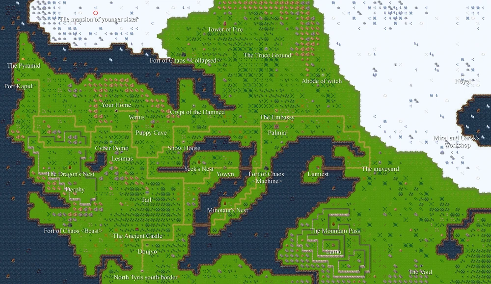
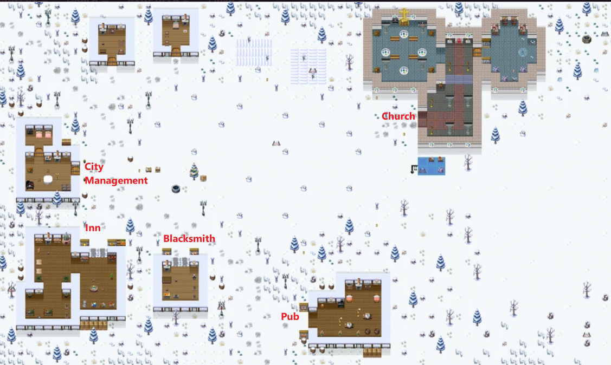

---
tags:
  - Game
  - Entertainment
  - Elona
  - 伊洛娜
---
# Elona 伊洛娜 （目前在玩这个）
这是一款超高自由度的文件极小的RPG游戏。（不是手游，手游很不一样）

# 网络资源
1. Elona 英文wiki（[链接](https://elona.fandom.com/wiki/Elona_Wiki)）
2. Elona 中文wiki（[链接](https://elona.huijiwiki.com/wiki/%E6%B8%B8%E6%88%8F%E7%95%8C%E9%9D%A2)）

# 下载
## 游戏本体
游戏本体可从[官网](http://ylvania.style.coocan.jp/index_e.html)下载（有日文和英文旧版本)
	- 或者从[我的Google Drive](https://drive.google.com/drive/folders/1PS2Oj3zgIn9_DPwHRu2qBoM3OOg5a82M?usp=sharing)下载，有两个版本，稳定版(1.16)和开发版(1.22)。建议用稳定版，因为我在开发版里面遇到过bug...
	- 同时，对画面和音乐有高要求的玩家，可以下载音乐包Elona mp3和美化包Elona Graphic Pack 。音乐包下载后解压，把mp3文件复制到游戏目录的user/music 下；美化包解压后，把graphic文件夹直接复制到游戏目录覆盖。

## 游戏变体
有一些其他玩家开发的版本(见[列表](https://w.atwiki.jp/elona_valiant/pages/137.html)），其中最有名的两个是Elonaplus 和Omake overhaul

这里有一条[Reddit](https://www.reddit.com/r/Elona/comments/cld1d3/elona_or_omake_overhaul/)的讨论，这两个到底选哪个版本。
#### Elonaplus
这个是我目前在玩的版本。可以从[开发者的博客](http://wanwanplus.blog.fc2.com/blog-entry-38.html)下载（日文，需翻译工具）

## 其他工具
### Elona Extender
是一款可以给elona (或者elona +) 添加额外显示的工具，比方说现实食物腐坏时间。 但只有英文版和日文版。
主页[在此](https://www.elona-extender.com/english-page/)。
### ElonaPlusCustom-GX

ElonaPlusCustom-GX 是一个在ElonaPlus 基础上添加的Mod，提供了更多更精确的英文翻译，以及一些功能上的微调。和最新版2.18R版ElonaPlus兼容的是[这个](https://github.com/JianmengYu/ElonaPlusCustom-GX)

这个Mod的是由不同的 人好像接力棒一样不停接手开发的……
一开始叫[Elona+Custom](https://elona.fandom.com/wiki/Thread:29851), 后来叫[Elons+Custom-G](https://elona.fandom.com/f/p/3340109923483964385), 后来变成了[Elona+ Custom-GX ](https://github.com/Ruin0x11/ElonaPlusCustom-GX)（兼容ElonaPlus 2.15R）, 最后才变成这个ElonaPlusCustom-GX 2.18R版本的。

### 其他Mods
[NexusMods](https://www.nexusmods.com/elona/mods/) 上面有一些

# 操作

这个游戏入门最劝退的是操作。但是如果你懂英文会方便很多。
大部分时候只能用键盘控制。走路用方向键，互动用空格键。
可以呼出三个大界面，z是动作界面，x是背包界面，c是玩家界面。
动作界面进入后用上下左右键选择。
背包和玩家界面进入以后使用tab进行不同选单的切换，然后就是用上下左右选择（或者直接按某个选项对应的字母）。

## 快捷键
但是，如果你了解一些常用的快捷键会方便很多。快捷键是分大小写的。可以按shift或者使用Caps调成大写后再按。

如果你的键盘没有某个按键（比方说笔记本没法直接按*) 这些快捷键都可以在游戏目录下找到一个config.txt文件，进行修改。

### 呼出界面的快捷键
d- drop 丢弃/放置
t - tool 使用道具 （包括恢复类药物）
j- journal 记录（包括任务记录）
e- eat 吃
q-quaff 喝
r - read 阅读（书籍、卷轴、法术书、鉴定书等等）
w - wear 装备
c - character 玩家
o - open 打开
B - blend 混合
E-Examine  查看背包内所有物品
? - 帮助
/ - 展开记录（对话框）

### 动作的快捷键
g- grab 拾取
f- fire 攻击
T - throw 投掷
b - Bash 冲撞 （按下以后会让你选择方向）
D- dig 挖掘 （按下以后会让你选择方向）
R- rest 休息
S- save 存档
* -选择目标

## 特殊场合的操作
### 战斗
靠近敌人后按f 来进行攻击
也可以先按* 选择攻击对象再攻击

### 钓鱼
你需要先按B 把鱼饵和钓竿混合到一起，然后站在水边，按t使用鱼竿。系统会问你要用多少鱼饵，也就是钓多久。 你选择以后你的小人就会开始钓鱼。在小人头顶出现感叹号的时候说明有东西上钩了，按T 投掷，就可以钓上来。 （不知道为什么好多说明都没有提按T这一点，我琢磨了半天才明白）

# 状态

# 世界

## 城市
###  Noyel

###  Port Kapul

	

# 物品
‘详见：https://elona.fandom.com/wiki/Item_table

# 赚钱的方式

## 倒卖物资
详见 Cargo https://elona.fandom.com/wiki/Cargo?so=search#Elona+
我自己整理表格：

| Cargo          | City       | Buying Price | Selling Price | Note |
| -------------- | ---------- | ------------ | ------------- | ---- |
| Canvas         | Palmia     |              | 627           |      |
| Canvas         | Palmia     | 836          |               |      |
| Canvas         | Port Kapul |              | 1534          |      |
| Canvas         | Noyel      |              | 1204          |      |
| Christmas Tree | Noyel      | 7000         |               |      |
| Grave          | Port Kapul | 9922         |               |      |
| Inner Tube     | Noyel      |              | 171           |      |
| Inner Tube     | Port Kapul | 88           |               |      |
| Manboo         | Port Kapul | 1713         |               |      |
| Manboo         | Palmia     | 4569         |               |      |
| Mario          | Port Kapul | 1472         |               |      |
| Mario          | Palmia     | 1472         |               |      |
| Piano          | Port Kapul | 14729        |               |      |
| Rag Doll       | Palmia     | 919          |               |      |
| Ration         | Port Kapul | 142          |               |      |
| Ration         | Noyel      |              | 115           |      |
| Ration         | Noyel      | 154          |               |      |
| Rope           | Port Kapul | 436          |               |      |
| Rope           | Palmia     | 732          |               |      |
| Snowman        | Palmia     |              | 2103          |      |
| Snowman        | Port Kapul |              | 2475          |      |
| Snowman        | Noyel      | 1155         |               |      |
| Tuna           | Port Kapul | 562          |               |      |
| Tuna           | Noyel      |              | 1386          |      |
| Whisky         | Palmia     | 3484         | 2613          |      |
| Whisky         | Palmia     | 3088         |               |      |
| Whisky         | Noyel      |              | 2613          |      |
| Whisky         | Port Kapul |              | 2613          |      |
