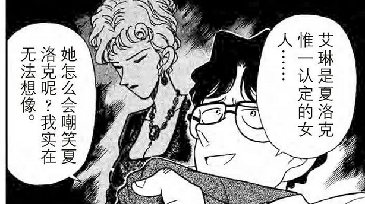
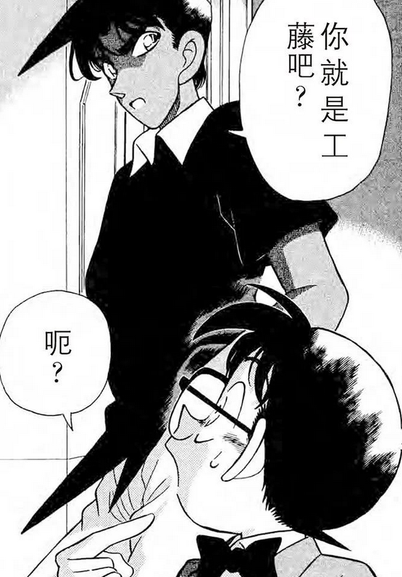
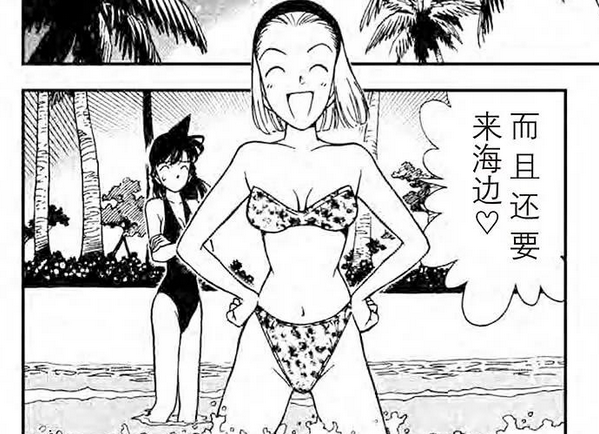
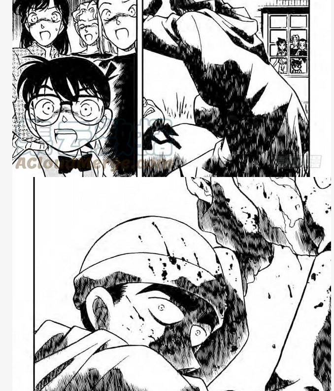
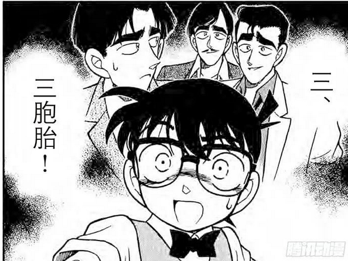
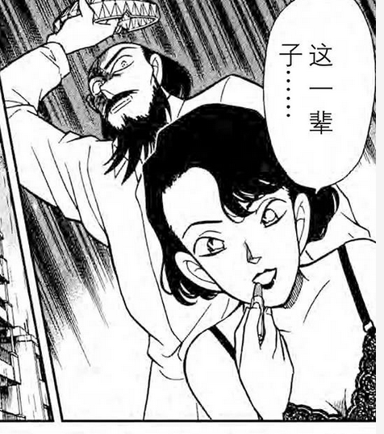
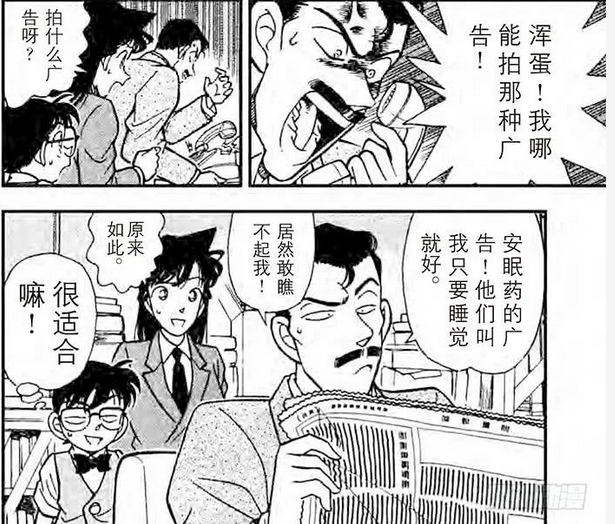
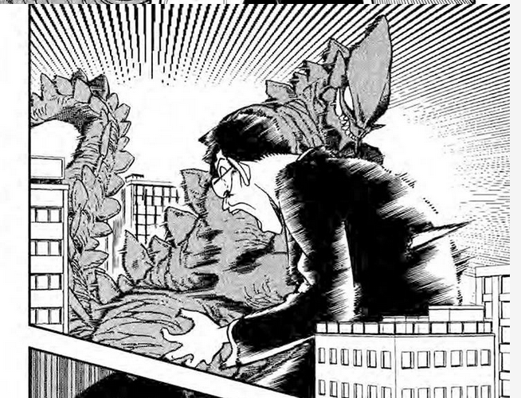

# 无剧透回顾名侦探柯南漫画 (13) Vol.13 121-130话
# **121 真面目**
杀人动机是书迷觉得出版社出版了OOC的书……
说起来啊，刻意在小哀出场前几话提到了“艾琳是夏洛克唯一认定的女人”，实在是让本柯哀党不能不yy，哈哈哈哈。

看穿了！

# **122 目击者是**
其实园子也蛮可爱的

我去，他们第一次看到凶手了！

但是看到了还是要三选一……笑麻了

# **124 悲哀的兄弟羁绊**
揭秘篇

# **125 坠落的尸体**

诶？证明题？

# **127 花与蝶**
我觉得漫画开始进入比较常规的单元剧模式了
这里有笑到我

# **128 逃亡者**
被怪兽杀掉了……

