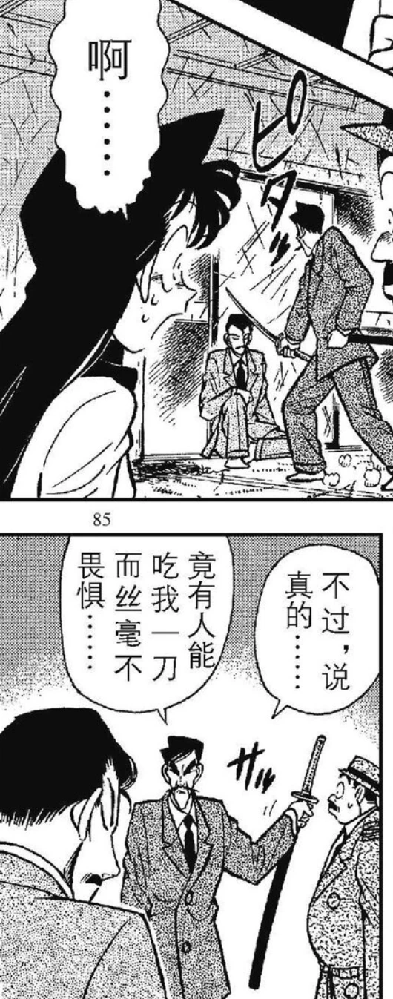
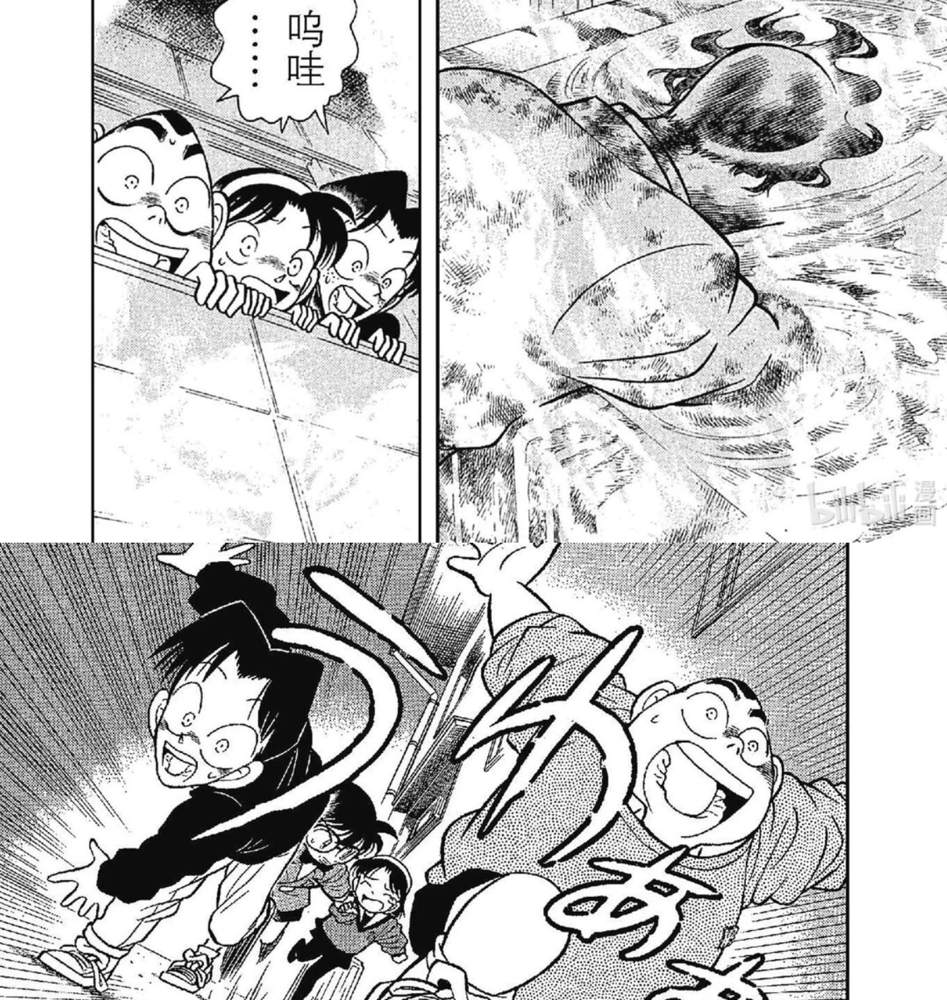
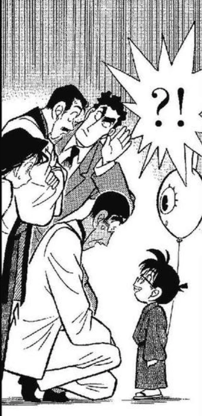

# 无剧透回顾名侦探柯南漫画 (6) Vol 6: 51-60话
# 051 面具下的真相

可真会卖关子，居然放在下一卷来讲完这个故事

不愧是你，优作，一下看穿了。

爸爸桑也做过和小哀一样的事情，用假手枪2333

自称自己”首屈一指“2333， 爸爸和儿子一样臭屁啊原来

芜湖~帅哥和美女！

按照73的画法，这种画风果然就是大美女。Again，还是浅色头发，卷发。  

猜对了，阿笠博士2333 之前是肚子暴露了啦  

说起来73还记得这一格吗？……优作有拜托国际刑警的朋友找解药

17岁的叛逆少年啊……啊这里确实是立得住的，怪不得兰厨拿着这里说新一是恋爱疯子

其实工藤夫妇对新一喜欢小兰这件事情是很揶揄的态度。起码这里看来是这样的。所以一些柯哀党说工藤夫妇不喜欢小兰这个未来儿媳也是乱讲……虽然我是柯哀党，但是咱要实事求是……

  

哈哈哈哈哈有仇不报非君子的新一

# 052 三名拜访者？

来了来了，这一案也很经典。虽然不记得具体的，但是对这个柜子记忆深刻！

同样死得很吓人的受害者

大叔这个充满智慧的眼神好好笑

# 053 三人的不在场证明  

豪华三选一

听说小兰初期的设定是”华生”。我觉得有点这个味道了这里。

    这……被当成杀人犯和社死相比也很难说哪个更惨

# 054 电话答录机之迷

这种时间线梳理，可谓很替读者着想了

小柯躲在毛利身后举他的手，却有百分百不被看穿的bug

# 055 柜子的秘密

解密篇。

他不害怕是因为睡着了啊喂2333c  

  

# 056 少年侦探团成立

哦！这个徽章出现得很早嘛！原来是有了徽章才成立侦探团的。仔细看上面写着Detective Boys... 形状也是DB...那步美一个女生为啥在boys里面……  

让小孩看到的现场……这个抱头鼠窜画得好

# 58 会移动的尸体之谜

徽章内部构造图。仔细看有调频钮，和一个按钮。严谨  

居然想脚踢白菜……白菜先炸了233

那时候踢中硬物还会疼诶，还不是超人

  

# 59 祭典之夜

这一案也很经典。我虽然不记得细节了，但还记得关键证据。  

横沟警官首次出场。这脸是方的吧，完全

他原来一出场就是大叔的迷弟2333

横沟还是可以的，直觉很准，明显在怀疑犯人了

# 060 无懈可击的不在场证明？！

你看这一格的表情对比。前面的内容是，嫌犯已经暴露出了自己杀人的动机是为了取代受害者交稿给出版社。毛利大叔还是一脸懵逼，横沟因为破解不了对方的不在场证据而不甘心，小柯是一脸下定决心的样子，似乎已经窥见端倪。这里可以推断出智力等级了2333

然后下面柯南点出犯人的漏洞的时候，毛利家的两人都愣神地盯着，但横沟警官就超认真地在听。我合理怀疑横沟后面会不会识破小柯。

揭秘环节还是在下一卷。留了个钩子啊。