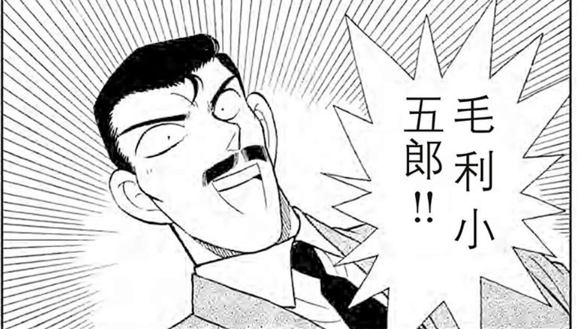
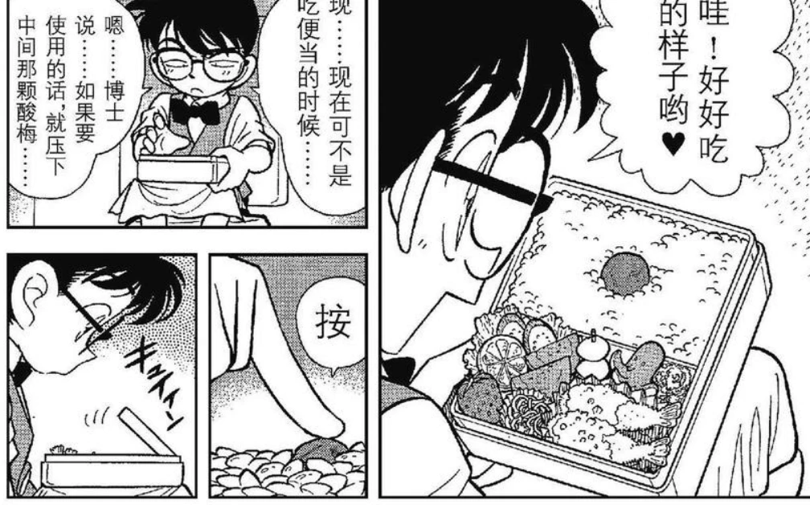

# ​061 照片内的陷阱

那个时候还会贴心地给个几格来说明如何把大叔的pose摆好。现在直接自动变成合适的pose了。

小兰提到新一的时候是很崇拜的样子。我这里又要怀疑横沟警官会不会看出啥来了。

哈哈哈哈早期钻在毛利身后还会被发现。很合理。

案件结束后……这不引人怀疑吗……看一群警官也很诧异的样子。我强烈怀疑原本的短篇计划就是让柯南在数次破案后被那些警察们看出来。

# 062 月影岛的邀请函

哦哦，这个暗号也很有印象！

这个被诅咒的钢琴的传说……弹着琴被烧死的画面怪恐怖的

目标地正在选村长，有3名候选人。我猜这三人就是嫌疑人……是有多喜欢3这个数字啊  

原来漫画是这样描写乐声的，用乐符

不出意外的话就出意外了

早期还会给这么大一格的死者面部特写……吓人的哩

# 063 钢琴的诅咒

笑死，毛利帅气无比地装完逼以后，没人认识他。

仔细看左边，他有点脸红  

你说小五郎这里斜眼看柯南的时候，是真的不知道吗？明明几话以前他还在怀疑这小子不简单。  

# 064 遗留的乐谱

诶？小兰原来是有会弹钢琴的设定的哦！  

  

这个从窗户出来的小黑，好吓人

又死一个……连环杀人案，这一集的动画应该要看了

# 065 业火的秘密

  

我怀疑青山在唬人……所以自己试了一下！全部的对照应该是下图。可以的，严谨。

  

# 066 染血的按键  

从这里开启了小兰日常发现受害者然后尖叫……  

  

# 068 新一的恋人！！

这一话出现了小兰的情敌2333（虽然不是真的）我发现，73喜欢把小兰的情敌画成浅色卷发的样子。这个发型是不是跟后来的灰原也有点像？ 不过按照名柯漫画的一贯画法，浅色卷发的通常是美女。怪不得小兰有危机感2333  

柯南竟然臭屁地问这个小姐姐，新一是不是她的初恋情人……还脸上有些红的……真是够了啊

这下还调笑不？汗都下来了吧

噗哈哈哈哈，小兰暴怒了

# 069 名侦探小兰？！

便当型传真机……

这个发明没有继续被用的原因，可能是因为，后来大家基本不用传真了……时代的眼泪啊  

额……该怎么吐槽好呢，标题是名侦探小兰，我本来还期待小兰也逐渐掌握了破案技能。结果，小兰侦察的原因是因为觉得新一有了别的女人，要找他算账才异常敏感……orz 青山刚昌啊说你什么好。能不能对小兰好点。  

# 070 要命的时限？！

噗……怪吓人的

溜了溜了溜了  

  
揭秘篇还是在下一卷。