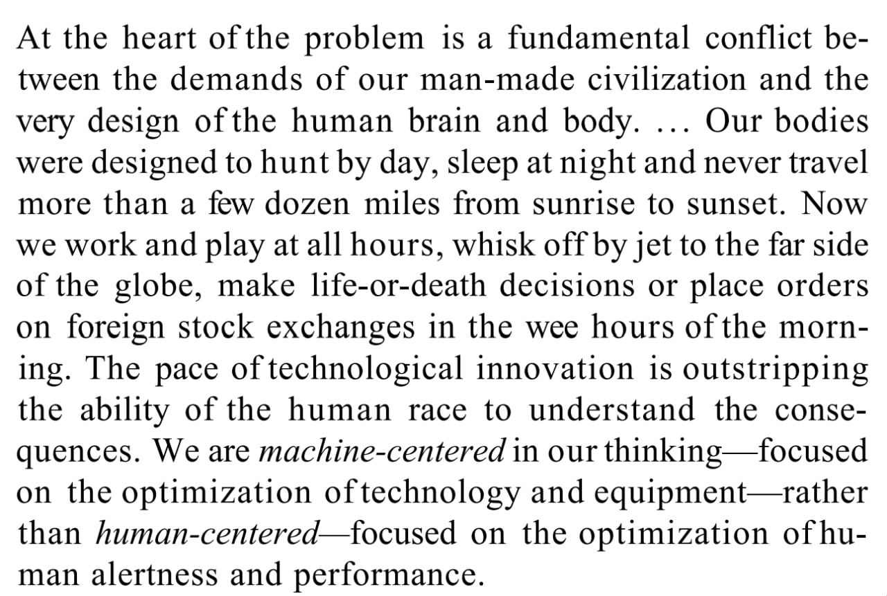

> [!NOTE]
> 
> 所有问题的根源在于人造文明的要求和人类身心构造的根本冲突。人类人体的构造适用于白天去打猎，晚上去睡觉，在日出和日落之间行进不进行超过几公里。现在我们没日没夜地工作和娱乐，瞬息飞到地球的另一边然后调整日差，在清晨须臾之间需要做生死抉择，或者买卖股票。科技革新的步调已经快到超越了人类能理解其后果的速度。我们如今的思维是以机器为中心的——专注于优化科技和设备——而不是以人为中心的——专注与优化个体的警觉性和表现。

