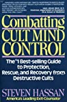

# Cult or not? - Reading *Combating the Cult Mind Control*

[Combatting Cult Mind Control: The #1 Best-selling Guide to Protection, Rescue, and Recovery from Destructive Cults](https://www.goodreads.com/book/show/173711.Combatting_Cult_Mind_Control)

I'm trying to reflect on my own church experience as I read through this book. The church I went to is a nondenominational church. They met from house to house. They had their own Bible. They had a very large amount of internal literature written by past leaders, I've been wondering a lot: are they cult or not?  
As I read through the book , I found that many experiences I had are very similar. They may or may not be cult, but there is definitely something wrong with their practices:

1. **They recruit people, strong, brilliant, and smart people in a subtle way.** Or you can say, they cultivate people into smart ones. The members include ivy-league graduates, PhDs, university professors, and staff. They recruit people using the company interns, student organizations, and events. I was initially an intern in their company. Then I was invited to their meeting one day, and a BBQ gathering another day. Eventually, I joined them. How can you resist warm, smart, and brilliant people with deep insight into life?

2. **They changed every aspect of my life, clothes, food, diet, where to live, and how to live.** I gradually become very dependent on them. They have "brothers house", "sisters house" and "couples house". Because I live with them, unavoidably, I was impacted in many ways in my life. What's worse is that "I'm willing to learn" because they seem to be smarter, happier, and stronger. They took me to go to goodwill and get clothes, my own style was said to be "too childish" in their eyes. They promote healthy diet "plant-based food", so we usually don't eat meat and processed food. I was assigned to share my room with another lady. In the beginning, I didn't have a car, and now I moved into their house so I was far from the city bus line, I had to depend on them to send me to school and pick me up. Therefore, I shared my schedule with them. Sometimes I still wanted to remain some sort of independence, like if I missed the schedule with them, I would call an Uber. But many other times I would be told to "rely on them more because we are families". In the end, when I do things on my own, for example, if I fix my car without letting the leader know, who's expert in cars, I would feel guilty because it implied that "I didn't take them as my family".

3. **Their teaching emphasized self-denial**. Over-addressing this can be used to wipe out the original identity of a person and create a false new one. "I'm crucified with Christ, nevertheless I live, yet not I, but Jesus Christ lives in me". "I am not my own, I am not my own, I belong to Jesus, I am not my own." We sing hymns like this a lot. The melodies of the songs are happy and joyful, implying that it's a good thing to "be not yourself". They have a theory of "body, soul and spirit", and there's a book called "breaking of the outer man" and "releasing of the inner man". Therefore, outward things like your knowledge, strength, wisdom, and emotions need to be "broken" so that you no longer use them solely for your own purpose, but "use it for God". "we are merely God's channels, God's oracles". A widely used example in the Church is that we human beings are like Gloves, without God, we are nothing but a shell, so we need to fill it with many other things. Whenever we suffer or got rebuked, the teaching is "whoever wants to follow me shall take up the cross". Members are hinted not to trust himself, but people around him, because a person cannot see himself clearly, and the way to know God's will is to 1) look at the environment, 2) look at God's words, 3) look at group members' reactions.

When I got out of that environment, who I am gradually came back. I start to know what I like and what I don't like. I have my own hobby and my own style. It is wonderful to be myself again.

4. **They divide the world into insider and outsider.** Even though it's not put into words, it seems like, the world outside the church is corrupted, full of evil and deception. Even among the religious groups, other churches seem to be not "spiritual" enough, focusing too much on the format than reality, or merely entertainment, or too out-of-date.

5. **They got involved in members' life too much**. For example, how a person studies, works, how they deal with relationships with parents, how they deal with marriage problems, how parents teach kids. People's attitude shall be open and receiving always. The leader often criticizes American's independent attitude as "pride". "Americans always think, who are you dare to be my boss". People who were once offended and left by their offensive words are considered "too shallow" and not able to take the meaning behind the words. For example, the leader once told a story, an ex-member was told to lose some weight and they were offended and left. The leader said "he was offended?! I can't believe he was offended like this!" Another example is that, when I left the church, the leader said I was like the prostitute in the Bible, selling myself to the world. And he said, "young people today are too shallow to understand, see, she was offended". I knew what he meant by saying these, but I also think rude words like this shall never be said to a young lady.

6. **They despise logical thinking.** Logical thinking is considered of "tree of knowledge of good and evil." We know that eating this fruit "you will surely die", die spiritually. People who graduated with Ph.D. degrees are often criticized as "having a large brain but no spirituality".

7. **They took members' time purposefully.** One member once told me that the leader said he would like to take all the time of us so that we are not wasting time on worldly things. They had long meetings of 4 hours, weekend activities, weekday night readings, etc.

8. **They said members are free to go, but actually not.** I left the church twice. The first time, I failed to leave because I initiated it and I still had strong guilt of leaving. They said to me, "why do you think you can just come and go?" But the second time, I saw how wrong they treated me and other members. When I asked to leave, they condemn me saying I "cut the relationship". And I was pictured as an evil person who lied to everyone just to gain benefit from the Church and rebuked with words such as "demon-possessed" "Cain".

9. **They pressured the whole church to join missionary work.** it is described by the leader that there's no truly good literature outside that Church, therefore we needed to do literature work. There are two approaches: 1) conventional approach 2) new media approach. Therefore, for the fist approach, we spent a lot of time transcribing meeting audio recordings into text. For the second approach, we set up a website, edit videos, host events,

10. **They practiced "hot seat" a lot.** They usually sit in a circle in meetings, and when someone made a mistake that's considered severe in the leader's eye, he will announce it in front of everyone. It is not until I was in that position of being singled out that I realized how stressful it is.