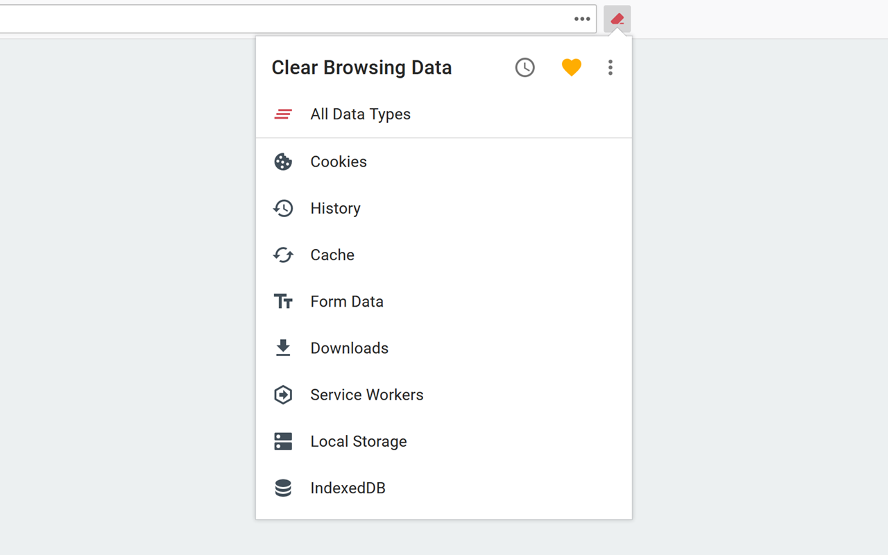
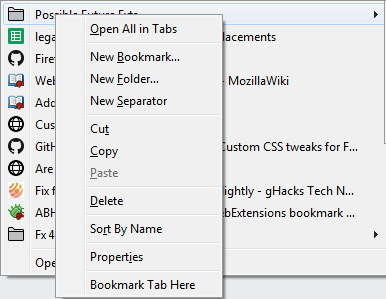

# 浏览体验类
## Clear Browsing Data
https://addons.mozilla.org/en-US/firefox/addon/clear-browsing-data/?utm_source=addons.mozilla.org&utm_medium=referral&utm_content=search

## Bookmark Tab Here
https://addons.mozilla.org/en-US/firefox/addon/bookmark-tab-here/?utm_source=addons.mozilla.org&utm_medium=referral&utm_content=search
让你能右击选中某个文件夹然后把书签存到这里

## Undo Close Tab
每个人都经历过误关标签，这个小工具可以让你打开上个关掉的tab

##  Profile Switcher for Firefox
如果你有小号的话，这个插件让你方便地在各个号之间切换

## Tamper Monkey
可以让你使用很多其他scripts
另见：[[Tamper Monkey scripts 推荐]]

## Mate Translate
提供划词翻译和整页翻译

# 版权类
## Unpaywall
解开很多因为版权锁住的网站
## Medium Unlimited
如题
## Save Website as Image
有的网页内容不允许你保存。所以这个工具可以把整个网页存成图片或者pdf.

# 下载类
## Video DownloadHelper
可探测到很多播放过的视频并让你下载

# 数据类
## EverSync
让你同步多个浏览器之间的标签

# 美化类
##  Stylus
让你可以用CSS美化任何网页

