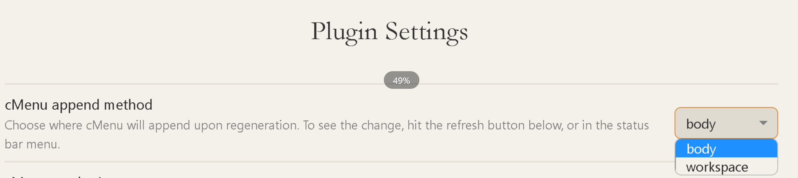

# 介绍Obsidian
Obsidian是一款笔记软件，它打出的口号是“你的第二个大脑”。实际上它和一般笔记软件（例如Onenote, Evernote)不同的地方，我认为是三点：
1.  能方便地支持文档的相互链接
2. 支持来自用户群的开源插件
3. 以Markdown为主要编写模式

所以这款软件和一般的笔记软件相比，有着相对较高的学习门槛。但是一旦你习惯了它，这款软件能极大地满足你的控制欲、管理欲（就是所谓的知识管理）和输出欲。如果你愿意上手尝试一下，可以跟着我这篇文章来试用看看。 （注：由于我更习惯英文界面，所以下面的软件截图皆为英文版。）

---

## 文档相互连接
Obsidian这个软件的最大特色，就是它提供了一种新的构建笔记网络的方式。以往我们的笔记可能是以树状按照类别分布，或者按照tag归类。Obsidian在两者都有的基础上增加了一种新的连接文档的方式，就是通过文档内链。

你在书写当前笔记的时候，发现当前的内容可以和从前的某个笔记相联系，你就可以输入两个英文状态的书名号，Obsidian会自动打开一个界面让你链接之前的笔记。如下图gif 

或者在你书写的过程中，你有一些关于某个概念的额外的想法需要将来补充，你可以选中这个概念，点击英文状态的书名号两次，选中的文本就会变成一个链接。你下次点开的时候就会自动创建一个以该文本为名称的笔记，如下图。

文本之间的联系可以通过所谓的graph view来图像化。我自己是不太用到这个功能……但是很多人好像很喜欢

前文说了Obsidian也是有tag支持的。这个软件的tag是精确到段落。你可以通过搜索功能查找到提及相应tag的文本段落。

## 初始设置
在下载安装完了这款软件以后，你首先要知道它的所有文件都存放在本地，而那个根目录文件夹被称为vault。 打开一个vault就会打开一个Obsidian窗口。如果你想要移动整个vault，找到那个文件夹就行。

你可以去setting里打开一些基础设置，比方说，Editor -> behavior 下面有一项 spell check，如果你和我一样是不擅长拼写英文的人……

还有可以创建一个文件夹专门用来放attachments，因为插入的图片都会自动保存成attachment

还有可以在core plugin里面打开file recovery，这样即使电脑出了什么故障，也可以取回备份……

### 设置外貌
如果你像我一样是严重的软件颜控党，那就跟着我来看看如何把Obsidian设置成你喜欢的样子。
首先许多用户已经上传了各种漂亮的主题。 settings -> appearance -> themes (manage) 就可以打开。

我尝试了n多种以后现在在用的是自己调整过的Shimmering Focus 主题。这个主题的特色是极致简洁……隐藏了很多按钮和栏目。一般每个主题都有light和dark两种模式，看你喜欢~ 在此推荐下载另一款插件Style Settings，可以让你进一步调整主题的一些细节（比方说颜色，还有是否显示某些内容等等）。Shimmering Focus这款主题是对Style Settings 插件非常友好的，我通过这个插件恢复了某些被shimmering focus隐藏的常用按钮。

这里就要提到下面要涉及的另一个主题：安装插件

## 安装插件 community plugins
在Settings -> Community plugins 可以安装一些用户上传的插件。安装了插件以后要确保这些插件是enabed的了，不然无法使用。

除了Style settings以外，我在这里推荐几款能够让你迅速上手这个软件的插件。
### 1. cMenu
如果你不喜欢使用命令，不擅长编程，这是你必须安装的插件。Obsidian的很多功能都需要去Command Palette输入命令。而cMenu的功能就是在你平时的界面上加入一个浮动菜单，让你能把常用的命令变成按钮。

安装了新的插件以后可以在设置界面的下方找到插件的设置。

首先要把append method调整成body，这样才能在一般界面出现浮窗。

可以点击删除键来删除既有的按钮；点击+按钮添加你心仪的命令，有时候在你选择了命令以后会跳出一个界面让你选择一个对应的icon. 

下图是我的cMenu浮窗，我添加了我常用的功能，包括插入代码block, highlight当前文字，插入当前时间，插入引用，插入链接等等。

### 2. Highlightr
如题所示，就是一个highlighter，高亮文字。可以自定义高亮模式、高亮颜色等等。

### 3. Calendar + Periodic Notes
如果你喜欢写日记、周记等等，这两个插件是必备的。Calendar插件会在界面右边显示一个日历区域，你可以点击任意一天创建那天的note，并且在每天下方通过点数显示你写作的长度。 而你可以通过Periodic Notes插件，创建日记、周记、月记等等。如果你两个插件都安装了，请在Calendar插件的设置里打开show week number，这样你可以通过点击week number 创建周记了。

你可以同时设置你的Periodic Notes的存放位置和模板。比方说我会在每天的日记上记录我的睡眠、心情、咖啡因、习惯、做了什么事等等。

### 4. Telegraph Publish + Imgur Plugin
Telegraph Publish这个插件可以让你在Telegraph上面分享你的笔记。但是如果想要笔记中的图片正常显示的话，需要设置图床插件把本地图片上传，我用的是Imgur。

当然我发现这两个插件的配合还是有一点点小bug, 偶尔图片会错位，要去telegraph上手动修改一下……不过这已经是我用过的最好的方案了……

### 5. Pandoc 
这是一个可以把你的notes转换为其他各种格式的插件。你需要同时在电脑上安装Pandoc软件来使用它的全部功能。
https://pandoc.org/installing.html

### 6. Kindle Highlights
如果你使用Kindle阅读的话，这个插件可以自动同步你在kindle store购买的图书的笔记和highlights。如果你用kindle阅读个人文档，也可以手动同步my clippings.txt 里面的notes和highlights. 但是这个插件的设置我没太搞懂，希望有大佬教我……

## 通过Command Palette 使用插件
在界面左侧找到Command Palette按钮，或者按control +p （Mac 用户应该是command + P) 就可以打开Command Palette， 通常你只要输入插件的名称就会跳出来该插件的所有命令。比方说上文提到过的Pandoc。 

如果你真的常用一个命令，又不喜欢每次都打开Command Palette，可以按照前文所述的，把它加入cMenu浮窗按钮里。

## 书写模式
Obsidian的书写模式是Markdown, 默认模式是editing, 并且live preview是打开的，所以你使用Markdown书写以后一回车，就会给你一个preview，变成漂亮的样子。对于没有编程经验的用户来说，使用Markdown乍一看起来很吓人，但是你其实只需要知道以下几点：
1. 分级标题通过“#[空格]标题 ”来实现。 几个“#”就是几级标题。
2. 标签可以通过“#标签”来实现，没有空格。打了标签的那一段在将来可以非常快速的被搜索到
3. “-[空格]” 会自动变成list , ”[数字].“ 会变成numbered list, "---[回车]" 就会变成分割线 剩下的其他格式可以通过cMenu上的按钮来实现
4. 插入图片可以通过复制粘贴、拖入图片文件等方式来实现。插入的图片在source code模式下是一行代码。不能直接编辑大小，但是你可以通过在.jpg后面加上 |width 来让图片变小，如图 

5. 你可以通过iframe 来嵌入任何网页，使用以下语句……这个功能对于不熟悉html的用户来说可能有点用不到……

7. 其他我个人常用功能包括
   
   - code blocks, 其实就是"点点点programming language [回车] 点点点“，这个点是~按钮 下面的点，例如：
   

- callout （可以是很多call out， 像是quote, info, note, 等等，如题用法见 https://help.obsidian.md/How+to/Use+callouts）

   
  
更多详细的markdown formatting可以参考这篇文章 https://help.obsidian.md/How+to/Format+your+notes

---
好啦，以上就是Obsidian这个软件的安利文章，如果你开始用这个软件了，可以和我讨论哦~ 
